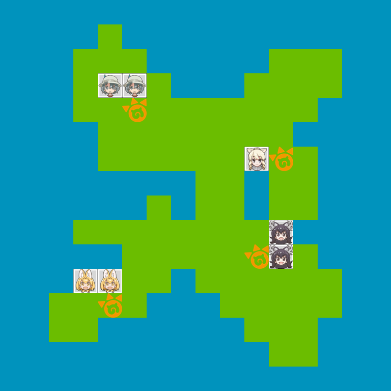

# Kemono wars

Kemono wars is a completely un-interactive online turn-based strategy.



## Dependencies

The processing requires the Pillow library.
```
dnf install python3-pillow
```

The requres player avatars images in `images/{player_id}.png` for players 1 to 31.

The use avatars from `friends-shogi.com`, run

```
make download-images
```

## Usage

The main script generates the map image, `result.png` and updates the state file, `state.json`.

```
python3 kemonowars.py
```

The resulting image `result.png` can then be used as needed (e.g. embedded into a html page).
